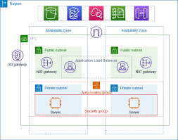

# AWS VPC with Auto Scaling & Load Balancing

This project demonstrates the setup of a scalable and highly available AWS VPC using Auto Scaling and Load Balancing. The infrastructure consists of two availability zones, each containing a public and private subnet. The Auto Scaling group ensures the desired number of instances is maintained, while the Load Balancer evenly distributes incoming traffic across the instances.

## Architecture Overview

The architecture diagram illustrates the key components of the project:

- VPC: The project utilizes the "VPC and More" option, which creates a VPC with four subnets - public and private subnets in 2 availability zone depending upon region you choose. This setup enables separation of public-facing resources and private backend resources. The VPC also provides a route table for the public subnet and two private subnets, along with an internet gateway to establish a public network connection to the internet.

- Auto Scaling Group: An Auto Scaling group is created with a template that specifies the configuration for the instances. In this project, two instances are launched in separate private subnets across different availability zones. The Auto Scaling group ensures that the desired capacity of instances is maintained based on defined policies. The desired capacity is set to 2, allowing a minimum of 1 instance and a maximum of 4 instances. This provides flexibility in handling increased traffic and ensures high availability.

- Bastion Host (Jumper Server): A bastion host, also known as a jumper server, is created in the public subnet. It acts as an intermediary to securely access the instances in the private subnets. SSH access is only allowed to the bastion host, adding an extra layer of security to the setup. Through the bastion host, you can log in to both instances in the private subnet and deploy your applications or make necessary changes.

- Instances: Two instances are deployed in two private subnets across two different availability zones. This configuration enhances fault tolerance and redundancy. You can deploy your applications on these instances, such as deploying simple static web pages or creating an index.html file with custom contents.

- Load Balancer: A Load Balancer is created in the public subnet to evenly distribute incoming traffic across the instances in the private subnets. A target group is created to direct traffic to the instances based on the HTTP1 protocol. The Load Balancer allows traffic on port 80, which is the standard HTTP port. Listeners are set up to receive traffic on port 80 and route it to the target group. Listeners are required to handle incoming requests and direct them to the appropriate resources, even though the security group for the Load Balancer already allows port 80 traffic.

## Deployment Instructions

To deploy and test the project, follow the step-by-step instructions below:

1. Set up the VPC and subnets using the AWS console. Choose the "VPC and More" option, which creates a VPC with four subnets - public and private subnets in each availability zone. This allows for the separation of public-facing resources and private backend resources.

2. Create an Auto Scaling group by creating a template that defines the instance configuration. In this template, specify the desired capacity as 2, minimum capacity as 1, and maximum capacity as 4. These settings determine the number of instances that will be launched and managed by the Auto Scaling group. The desired capacity represents the number of instances the group should maintain, while the minimum and maximum capacities define the lower and upper limits for scaling.

3. Launch the instances and deploy your web application on each instance. To access the instances in the private subnets, use the bastion host. SSH into the bastion host and then SSH into the instances from there. For security purposes, only SSH access is allowed to the bastion host.

4. On each instance, deploy static web pages or creating an index.html file with custom contents. Use the command `python3 -m http.server 8000` to start a simple HTTP server on port 8000, allowing you to serve your web pages. Replace this command with the appropriate command for your specific web server setup.

5. Configure the Load Balancer by creating a target group with the target type set as "instance" and the protocol version as "HTTP1". Specify the private instances as the targets for the Load Balancer. Configure the Load Balancer to allow traffic on port 80, and set up listeners to handle incoming requests on port 80 and direct them to the target group.

6. Access the Load Balancer's DNS or IP to access your web application. By accessing the Load Balancer, you can view the web page deployed on the instances in the private subnets. Refreshing the page will show changes from both instances, as the Load Balancer distributes traffic to different instances.

## Technical Concepts Explained

- Auto Scaling: Auto Scaling is a feature of AWS that allows for dynamically adjusting the number of instances based on demand. The desired capacity represents the number of instances the Auto Scaling group should maintain. The minimum and maximum capacities define the lower and upper limits for scaling. When demand increases, Auto Scaling can automatically launch additional instances to handle the increased workload. Conversely, when demand decreases, it can terminate instances to reduce costs and optimize resource utilization.

- `python3 -m http.server 8000` Command: This command starts a simple HTTP server on port 8000, allowing you to serve your static web pages or web applications. It is a convenient way to quickly deploy and test web content. Replace it with the appropriate command for your specific web server setup.

- Load Balancer: A load balancer is a networking component that distributes incoming network traffic across multiple servers or instances to ensure efficient resource utilization, high availability, and improved performance. It acts as a single point of contact for clients and evenly distributes the incoming requests to the servers behind it. The load balancer sits between the clients (such as web browsers or mobile apps) and the servers, acting as a traffic manager. It intelligently routes the incoming requests to the appropriate server based on predefined algorithms

- Listeners: In the context of the Load Balancer, listeners define the ports on which the Load Balancer listens for incoming traffic. They handle incoming requests and direct the traffic to the appropriate resources, such as the target group or specific instances. Even though the security group for the Load Balancer already allows traffic on port 80, listeners are necessary to route the incoming requests.

- Bastion Host: A bastion host, also known as a jump server, serves as an intermediary or gateway for accessing instances in private subnets securely. It acts as a single entry point to the private network, providing controlled and monitored access to the instances.

